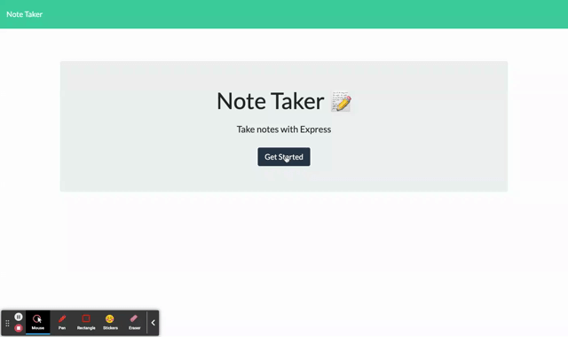

# < Express-Note-Taker >

# User Story

AS A small business owner
I WANT to be able to write and save notes
SO THAT I can organize my thoughts and keep track of tasks I need to complete

# Table of Contents

- [Links](#links)
- [Installation](#installation)
- [Preview](#preview)
- [Usage](#usage)
- [Badges](#badges)
- [Questions](#questions)

# Links

- [CLICK HERE](https://whispering-garden-23114.herokuapp.com/) for live link

# Installation

1. Clone this SSH Key link: "git@github.com:addiguskey/Express-Note-Taker.git" on your Terminal (Mac) or gitBash(Windows).

2. This app uses [Express](https://www.npmjs.com/package/express). You can simply install npm Express by running "npm i" on your Integrated Terminal in VS-Code

3. Click [Preview](#preview) for a demo of this application.

# Preview

# Usage

GIVEN a note-taking application

- WHEN I open the Note Taker,
  THEN I am presented with a landing page with a link to a notes page
- WHEN I click on the link to the notes page,
  THEN I am presented with a page with existing notes listed in the left-hand column, plus empty fields to enter a new note title and the note’s text in the right-hand column
- WHEN I enter a new note title and the note’s text,
  THEN a Save icon appears in the navigation at the top of the page
- WHEN I click on the Save icon,
  THEN the new note I have entered is saved and appears in the left-hand column with the other existing notes
- WHEN I click on an existing note in the list in the left-hand column,
  THEN that note appears in the right-hand column
- WHEN I click on the Write icon in the navigation at the top of the page,
  THEN I am presented with empty fields to enter a new note title and the note’s text in the right-hand column
- WHEN I click on the trashcan icon,
  THEN the saved note gets deleted and is removed from the left-hand column where the existing notes are displayed

# Badges

  

# Questions

For any questions, you can either reach out to me on GitHub or via e-mail

- Username: @addiguskey
- GitHub Link: https://github.com/addiguskey
- E-mail: addisonguskey@gmail.com
